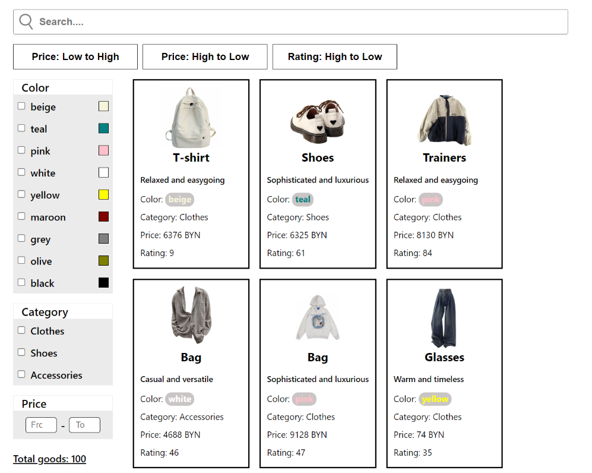

# React Shop

This project is basic example of shop.

## Preview on Desktop

## Technologies

- React
- React Hooks (and custom hooks)
- Typescript
- SCSS for styling

## Project Features

- Generating of products, specifying quantity (default: 500)
- Using multiple filters:
  - Filter by substring
  - Filter by color
  - Filter by category
  - Filter by price interval
- Supports the following types of sorting:
  - Sort by price in ascending order
  - Sort by price in descending order 
  - Sort by popularity

- Components are ready to be reused